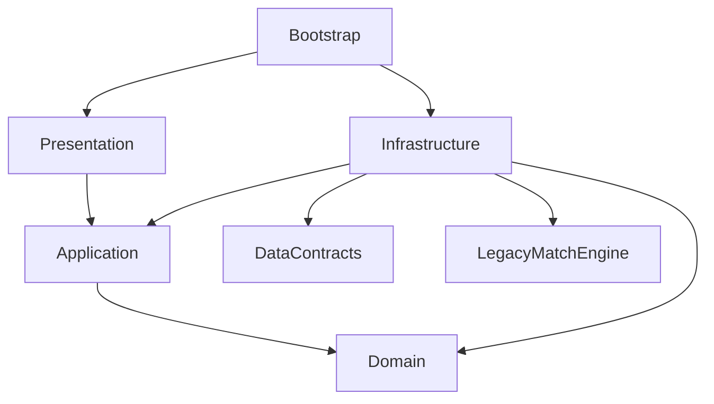

# Arquitetura do Futebol Brasileiro

Estado: catálogo observado v4, menu e suporte a campeonato demonstrativo. Domain,
Application, DTOs v1–v4, importador JSON, bootstrap e ponte com a partida 3D estão
implementados. O editor local mantém clubes, jogadores, países, estádios,
proveniência e aparência padrão. O jogo suporta uma liga com progresso local e
a criação de perfil de carreira. Simulação do calendário da
carreira, editor completo e processamento de skins continuam planejados
conforme [ROADMAP.md](ROADMAP.md). Contrato atual e extensões propostas estão em
[DATA-FORMAT.md](DATA-FORMAT.md); uso e testes em [README-DATABASE.md](README-DATABASE.md).

## Fundação atual

- `Domain`: ClubDefinition, PlayerDefinition, PlayerAttributes, PlayerPosition,
  RosterMembership e DatabaseCatalog imutáveis, com invariantes próprias. V4
  acrescenta CountryDefinition, StadiumDefinition e DatabaseSnapshotDefinition,
  incluindo fontes da observação e metadados cadastrais opcionais.
- `Application`: CatalogSession ativa um catálogo completo; LineupPlanner escolhe
  onze jogadores para uma formação. CompetitionSession coordena confrontos,
  tentativas, resultados, classificação e snapshots, sem Unity ou armazenamento.
- `DataContracts`: DTOs de intercâmbio, incluindo referências visuais separadas e
  os sete IDs de preset em BuiltinAppearanceData, sem enums do motor Unity.
- `Infrastructure/Importing`: JsonDatabaseImporter valida JSON e suas referências,
  cria DTOs e mapeia explicitamente para o domínio; não lê arquivos ou muda sessões.
- `Bootstrap`: FootballDatabaseBootstrap lê a base externa com UnityWebRequest e
  só ativa resultados válidos. A sessão sobrevive às trocas de cena/UI.
- `Editor`: FootballDatabaseBuildProcessor valida a base e a registra com um schema
  que aceita v1–v4 como StreamingAssets adicionais, sem criar fontes fora de
  FootballSimulator.
- `Infrastructure/LegacyMatch`: CatalogMatchAdapter converte os onze escalados em
  objetos temporários do motor. FriendlyMatchSession conecta catálogo, seleção,
  preparação e descarregamento; CatalogMatchLease mantém a revisão e os IDs.
  BuiltinAppearanceMapper resolve os IDs portáteis nos presets visuais existentes.
- `database-editor/client`: aplicação externa em ES modules, com rascunho único de
  edição, formulários, prévia ilustrativa e publicação explícita da base.
- `database-editor/server`: Node 22 com rotas HTTP, validação Ajv 8 dos schemas,
  verificação semântica e gravação do arquivo separadas em módulos.
- `Infrastructure/GameModes`: GameHubSession conecta navegação, campeonato,
  perfil de carreira, preferências, localização e armazenamento local. Os codecs
  convertem snapshots para saves versionados, fora do domínio.
- `Presentation`: GameHubView e componentes UGUI/TMP exibem consultas da fachada;
  prefab, tema e avatares são recursos editáveis no Unity.

O exemplo v4 contém 16 clubes e 363 jogadores relacionados nas súmulas de abertura
do Paulista de 10/11 de janeiro de 2026. É um recorte observado, não elencos
completos nem uma competição oficial jogável. Sua proveniência e aproximações
estão em [HISTORICAL-DATA.md](HISTORICAL-DATA.md); o caminho de autoria continua
`four-clubs.database.json` para preservar a integração existente. A seleção
aguarda o catálogo e apresenta seus clubes; o amistoso recebe nomes, medidas e
atributos importados. TeamEntry/PlayerEntry persistentes fornecem apenas recursos
visuais e formação via LegacyMatchBindings. Aparência completa em v2 tem prioridade
e dispensa binding de jogador; se omitida, preserva o caminho legado e seu default
declarado. Não há fallback para DatabaseService. Apenas a aparência embutida é
suportada; skins externas continuam planejadas. O regulamento executável continua
sendo round-robin v1; a amostra histórica mantém competições/edições vazias.

## Objetivos

- Reutilizar a partida 3D existente em campeonatos e temporadas.
- Editar clubes, jogadores, competições e regulamentos em uma aplicação separada.
- Importar conteúdo compatível sem recompilar o jogo.
- Permitir à comunidade enviar skins com modelos e texturas próprios pelo editor
  da base, associá-las a jogadores e utilizá-las na partida WebGL.
- Manter regras esportivas, estado de jogo, apresentação e armazenamento com
  responsabilidades e dependências explícitas.

## Módulos e dependências

Os novos módulos do jogo ficarão sob `Assets/FootballSimulator/Code/FootballWorld`.
A organização interna pode ganhar subpastas por assunto, como `Competitions`,
`Clubs` e `Players`, conforme existam funcionalidades reais.

| Módulo | Responsabilidade | Dependências permitidas |
| --- | --- | --- |
| Domain | Identidades, definições esportivas, temporada, calendário, resultados e classificação | Biblioteca padrão C#; sem Unity, arquivos ou serializador |
| Application | Criar temporada, iniciar tentativa de jogo, concluir confronto, consultar estado | Domain e contratos de execução definidos pela própria Application |
| Infrastructure | Importação, mapeamento de dados, integração com motor 3D, mídia e futuro armazenamento | Contratos, Application, Domain e bibliotecas específicas da integração |
| Presentation | Prefabs UGUI/TMP, apresentação das consultas e envio de comandos | Application e abstrações de apresentação visual |
| Bootstrap | Construir e conectar serviços; manter a sessão durante transições | Implementações necessárias à composição |

Setas abaixo representam dependências de código:

`DataContracts` é a especificação portátil e seus DTOs de intercâmbio. Não depende
do core ou de Unity. O importador converte esses DTOs em definições do domínio.
Domain/Application não dependem da representação JSON nem de seus atributos de
serialização. O editor externo compartilha schemas, exemplos e regras de
compatibilidade; não precisa usar a mesma linguagem ou carregar o jogo.

Domain e Application possuem assemblies separados, sem referências ao Unity;
Application referencia somente Domain. DataContracts e Importing também têm
assemblies próprios: apenas Importing referencia Newtonsoft.Json. Bootstrap é
uma assembly Unity que conecta os módulos, sem depender do motor legado.
O adaptador LegacyMatch e a UI existente permanecem na assembly padrão:
uma assembly criada por `.asmdef` não pode depender de classes em
`Assembly-CSharp`. Extrair o legado será uma mudança futura delimitada, se houver
necessidade. [Referência Unity](https://docs.unity3d.com/2022.3/Documentation/Manual/ScriptCompilationAssemblyDefinitionFiles.html).

Nesta integração incremental, MainMenuPanel/TeamSelectionTeam dependem da fachada
Unity FriendlyMatchSession; GameHubView depende de GameHubSession. São fronteiras
de composição concretas, fora de Domain/Application. As fachadas, Presentation e
adaptadores legados permanecem em Assembly-CSharp; o restante da UI e do motor
legado não foi repartido em novas assemblies.

Não introduzir um servidor para coordenar a competição local, repositórios
genéricos, um barramento global novo ou um framework de injeção apenas para
organizar pastas. Bootstrap conecta dependências explicitamente. Eventos globais
existentes ficam encapsulados pela ponte com o motor.

## Propriedade dos dados

| Informação | Proprietário | Tempo de vida |
| --- | --- | --- |
| Clubes, jogadores, vínculos iniciais, competições e regras | Base externa versionada | Revisão imutável importada |
| Países, estádios, biografia e recorte com fontes | Base externa versionada | Metadados observados; não são estado da carreira |
| Confrontos, resultados e progresso | Sessão da competição | Snapshot versionado salvo localmente; mudanças de elenco ainda futuras |
| Escalação e IDs locais de jogadores na partida | Adaptador e motor de partida | Uma execução de confronto |
| Retratos, escudos e skins | Catálogo visual e carregador de mídia | Recursos versionados, carregados conforme uso |

`ClubId`, `PlayerId`, `CompetitionId`, `SeasonId` e `FixtureId` são identidades
estáveis. Nomes e posições em listas são editáveis. A relação inicial clube/jogador
tem uma fonte de verdade na coleção de vínculos; não duplicar listas mutáveis em
ambas as entidades. Posição natural pertence ao jogador; posição na formação
pertence à escalação.

Uma temporada fixa a revisão da base e suas regras ao nascer. Atualizar o catálogo
oferece conteúdo para novas temporadas. Aplicar alterações a uma temporada
existente exigirá migração explícita. O save local guarda sua própria versão,
snapshot dos confrontos/resultados e o JSON da base ativada, incluindo os presets
e referências de skins declarados nesse JSON. Escudos, uniformes, formação e
aparências de fallback continuam vindo dos `LegacyMatchBindings` do build em uso;
o save atual não fixa revisões desses assets compilados nem empacota meshes ou
texturas. Alterá-los em outro build pode mudar a apresentação de um save antigo.

`DatabaseCatalog.Snapshot` descreve a observação autoral: data, escopo dos
relacionados e fontes. Não acrescenta intervalos de vigência a `RosterMembership`
nem seleciona outra revisão ao mudar a data da carreira. Nas versões v1–v3 esse
metadado é ausente, países/estádios ficam vazios e os novos campos opcionais ficam
nulos; nenhum país ou nascimento é deduzido do nome do jogador.

`PlayerDefinition.Name`, `FullName` e `Nickname` têm responsabilidades separadas.
`DisplayName` usa o apelido quando presente, preservando o nome compatível com
o legado e o nome completo. `PlayerId` permanece a chave em todos os casos.
Reputação, torcida, orçamentos e patrocínio são parâmetros autorais imutáveis,
sem efeitos financeiros implementados. Saldos, contratos vivos, lesões, cartões,
treino e histórico produzido pelo jogador pertencerão ao save e aos serviços
de carreira, sem modificar o catálogo importado.

O importador aceita até 1 MiB, mas o armazenamento local de campeonato atual
limita o envelope completo a 384 KiB, incluindo o JSON escapado. Aceitação da
base não garante que uma futura competição com esse conteúdo caiba no save;
a evolução do armazenamento precisa acompanhar elencos/histórico maiores.

ScriptableObjects continuam adequados à autoria de materiais, catálogos de
recursos Unity, prefabs e parâmetros de apresentação. Não são o armazenamento
autoritativo do cadastro externo nem do progresso da temporada.

## Integração da competição com a partida

### Ponte do amistoso implementada

- A seleção guarda ClubId e reaplica esse ID após reconstrução da UI; renomear ou
  reordenar clubes não muda a identidade. Só clubes distintos podem jogar.
- LineupPlanner exige onze vagas, um goleiro natural e dez jogadores capazes de
  atuar na linha. Faz correspondência máxima de posições naturais; empates usam
  PlayerId ordinal. Vagas restantes recebem jogadores de linha e geram aviso.
  Reservas e jogadores sem clube continuam no catálogo, sem truncamento.
- LegacyMatchBindings é um ScriptableObject editável que associa IDs a escudos,
  kits, formações e aparência local. Defaults declarados atendem recursos sem
  binding com aviso; um perfil de aparência completo no JSON dispensa o template
  de jogador. Nenhum atributo esportivo é lido desses templates.
- Cada CatalogMatchLease possui clones exclusivos dos times/jogadores, snapshot
  do catálogo e mapeamento dos IDs locais 0–21 para PlayerId/ClubId. Atualizar a
  base durante a preparação/partida não altera a execução ativa.
- Cancelar a preparação, sair da partida ou recuperar uma falha descarrega os
  consumidores antes dos clones. A sessão persiste quando a UI geral é destruída.
- Uma importação inválida bloqueia novas partidas e oferece Retry. O catálogo
  válido anterior permanece no bootstrap, mas não é usado silenciosamente para
  contornar a falha da última leitura.
- Perfil ausente usa aparência embutida. A referência builtin-player, revisão 1,
  perfil football-player-v1 é suportada. Outra skin em um titular bloqueia o
  clube com diagnóstico; reservas são verificadas quando escaladas.

### Competição implementada

- `CompetitionDefinition` e `CompetitionEditionDefinition` pertencem ao catálogo:
  participantes, datas por rodada e `LeagueRules` versionadas vêm do JSON v3.
- `RoundRobinScheduler` gera turno único ou ida/volta; clubes ímpares recebem folgas.
- `CompetitionSession` mantém SeasonId, FixtureId e ExecutionId independentes do
  motor. `BeginFixture`, `AbortFixture` e `CompleteFixture` coordenam a tentativa.
- `FixtureResult` copia o placar e as identidades antes do descarregamento;
  `StandingsCalculator` deriva a classificação. Empate esportivo completo mantém
  a mesma posição, sem escolher campeão pelo identificador.
- `DeterministicMatchSimulator` resolve os outros jogos da rodada. O clube
  controlado joga no motor 3D; jogos simulados são identificados na interface.
- `CompetitionSnapshot` guarda somente dados de progresso. O adaptador de save
  combina esse snapshot com o JSON da revisão fixada e valida ambos ao restaurar.

Só uma execução fica ativa por sessão. O confronto passa de pendente para em
execução e concluído. Abandono ou falha de carregamento devolve-o a pendente sem
placar; a nova tentativa recebe outro ExecutionId. Eventos de tentativas antigas
são ignorados. Repetir o mesmo resultado aceito é inofensivo; resultado conflitante
é rejeitado. A classificação é derivada dos resultados aceitos.

A sessão vive fora dos painéis. `MatchEngineLoader.CreateMatch` descarrega a UI
geral, e o adaptador precisa sobreviver a isso. Assinaturas de eventos e recursos
da partida são liberados em conclusão, falha e abandono.

Limitações observadas do legado que orientam a implementação:

- `TeamEntry` valida exatamente onze jogadores. O adaptador cria a representação
  temporária dos onze escalados, preservando o elenco completo no domínio.
- `MatchCreateRequest` atribui IDs locais 0 a 21. Manter um mapeamento para
  PlayerId; não exportar esses índices como identidade permanente.
- O placar definitivo é capturado na origem do apito final, antes da limpeza.
  Fechar estatísticas ou abandonar a partida não equivale a concluir um confronto.
- `GoalCelebrationScene` atualiza o placar. Preservar esse comportamento durante
  a primeira integração; qualquer separação posterior exige testes de gols.

## Editor local e base externa

O editor é uma aplicação separada, em `database-editor`, exposta em `/editor/` pelo
Nginx do jogo. O frontend não referencia assemblies Unity ou o core C#; compartilha
o contrato portátil e as opções de presets com o backend. A partida continua
recebendo conteúdo pelo importador C#, com validação própria, antes de ativar a
revisão. Não é necessário que o editor participe da execução da partida.

O recorte implementado permite CRUD de clubes/jogadores/estádios, cadastro de
países, proveniência, vínculos de elenco, biografias, metadados de gestão,
posições naturais, medidas, quinze atributos e sete presets visuais. Formulários
compartilham um rascunho em memória; salvar é uma ação explícita da base inteira,
e exportar JSON pode preservar mudanças ainda não publicadas. A prévia é uma
ilustração dos presets, não uma renderização do personagem do Unity.

V4 é uma evolução explícita do contrato. Abrir uma base v1–v3 não inventa data,
fontes ou localização para promovê-la silenciosamente. Ambos os importadores
validam forma, limites, referências e datas; dados opcionais desconhecidos são
omitidos, enquanto `null` explícito é inválido. O metadado de estádio não muda
o asset usado por `MatchEngineLoader`, que ainda seleciona o estádio legado.
`ClubDefinition.StadiumId` identifica o estádio oficial principal do clube.
Disponibilidade por período, eventos com efeito financeiro e exceções de mando
por partida são extensões futuras separadas desse vínculo; uma mudança temporária
de local não deve substituir o estádio principal no cadastro.

O backend separa parsing JSON estrito, schemas/referências, transporte HTTP e
`DatabaseStore`. A leitura devolve um ETag derivado dos bytes. O salvamento exige
`If-Match`, confere identidade/revisão, valida a base e incrementa a revisão. Escritas
são serializadas no processo; uma segunda comparação de hash detecta alterações
externas antes de substituir a fonte pelo arquivo temporário. Erros ou conflitos
não publicam o rascunho nem o apagam da aba. Uma cópia local da revisão anterior
fica em `Examples/.editor-backups/previous.database.json`; não representa progresso
de temporada, nem histórico completo.

No Compose, `database-editor` recebe escrita somente no bind do diretório de
autoria; executa como usuário Node com filesystem do container somente leitura.
`soccer-web` monta esse mesmo diretório apenas para leitura e publica um único JSON.
O editor não expõe porta no host: o proxy atende em `127.0.0.1:8080/editor/`.
Nenhum volume Docker persistente é necessário. O Compose aguarda o editor saudável
ao iniciar o servidor web, mas o carregamento do catálogo pelo jogo é direto no
Nginx e independe da API durante a partida.

## Importação no jogo

Fluxo: leitura do pacote -> validação estrutural -> validação de referências e
capacidades -> mapeamento -> ativação de uma nova revisão do catálogo.

O contrato estrutural é publicado em JSON Schema. Nesta primeira implementação,
o importador executa validações C# explícitas equivalentes ao recorte do contrato,
sem dependência de uma biblioteca de avaliação de schemas no player. O schema
também pode validar o arquivo externamente; não substitui verificações semânticas.
O importador
também verifica referências cruzadas, IDs repetidos, valores válidos e tipos de
regras suportados. O domínio mantém suas próprias invariantes. Um pacote inválido
não substitui a base ativa. Não executar scripts ou nomes de tipos recebidos em
JSON. Regulamentos parametrizam comportamentos implementados no jogo.

O editor atual oferece criar, editar, validar e exportar clubes/jogadores. Preserva
e valida as competições/regulamentos v3, editáveis no JSON; seus formulários ainda
não existem. A rota local ainda não importa pacotes gráficos. Hospedagem
de catálogos públicos pode ser acrescentada como outra origem de conteúdo; a
aplicação local não define autenticação ou publicação pública de uma galeria.

## Skins da comunidade

Importar uma skin personalizada é requisito da primeira versão utilizável do
editor externo. Selecionar presets é uma etapa intermediária. O caso de aceite é
um autor importar uma skin de jogador, por exemplo uma representação de Messi,
associá-la a um cadastro e vê-la animada no WebGL.

Uma skin pode fornecer cabeça, corpo, cabelo e texturas próprios dentro do perfil
de compatibilidade. `SkinId` é independente de PlayerId; sua revisão é imutável.
A vinculação fica no perfil visual do jogador e não determina atributos, colisão,
física, altura de gameplay, força do chute ou decisões de IA.

Separar dois artefatos:

1. **Fonte portátil:** modelo, texturas, metadados e mapeamento para o perfil de
   compatibilidade. Primeira rota proposta: FBX com rig compatível e PNG/JPG,
   seguindo um template de autoria fornecido pelo projeto. GLB poderá ganhar um
   conversor posterior; não existe importador genérico de GLB no projeto atual.
2. **Conteúdo preparado:** prefab visual, Avatar e materiais compatíveis, em
   Addressables/AssetBundles gerados para a versão do jogo e a plataforma alvo.
   O primeiro alvo é WebGL. O jogo carrega esse conteúdo preparado.

Na etapa futura de skins, o editor permitirá selecionar o pacote fonte, acompanhar validação e compilação,
visualizar o resultado processado, corrigir problemas e associar a skin pronta.
A preparação é uma operação separada, iniciada pelo editor e executada por um
worker Unity; não é uma operação do core ou do navegador. Inicialmente o worker
será local, usando o Unity ativado e uma área isolada de processamento. Um serviço
hospedado é uma opção futura, com sua própria implantação e ativação. O fluxo
válido não deve exigir que o usuário abra Unity e configure cada skin manualmente.

O perfil versionado define rig/template, escala, pose de referência, associação
dos ossos, slots de material, encaixe do uniforme e limites de recursos. Antes de
liberar importações, medir e fixar limites de malhas/texturas/memória com 22
skins distintas no WebGL, junto ao estádio e demais recursos da partida.
Não prometer reparo automático de rig ou compatibilidade com
qualquer FBX. O editor mostra o motivo da rejeição e a orientação para o template.

O jogo mantém controle sobre Animator, eventos de chute/passe, componentes de
gameplay e shaders permitidos. Preservar as referências e os offsets usados para
posicionar a bola, além da fase dos eventos de passe/chute: um Avatar válido não
garante sozinho que o contato com a bola continue correto. Fontes da comunidade não introduzem scripts,
plugins, controladores executáveis ou alterações de regras.

Hoje `PlayerGraphic.SetPlayer` substitui o material principal pelo uniforme.
O adaptador visual deverá separar slots de pele/rosto/cabelo e uniforme, preservar
texturas personalizadas e testar troca de clube e uniforme de goleiro. Uma skin
deve continuar reconhecível usando os uniformes da competição.

Skins ausentes ou incompatíveis produzem diagnóstico visível e usam o modelo
padrão aprovado quando houver fallback autorizado pelo contrato. O vínculo
original é preservado, para permitir recuperar o recurso depois. Exportar uma
base sem suas dependências gráficas exige uma indicação explícita no manifesto.

Distribuir conteúdo compatível por Addressables permite atualizações de recursos
sem republicar o player, depois que o carregador e o contrato estiverem presentes.
Mudanças de código, shaders não suportados ou contratos podem exigir um novo
player. [Referência Addressables 1.22](https://docs.unity3d.com/Packages/com.unity.addressables@1.22/manual/remote-content-intro.html).

## Verificação

Cada etapa segue o [AGENTS.md](AGENTS.md): preservar mudanças alheias, gerar build
WebGL novo para código e recursos compilados, servir com Compose e validar o
comportamento afetado. Edições compatíveis exclusivamente no JSON externo são
servidas diretamente pelo bind local e verificadas com refresh, sem novo build.
Mudanças somente no editor, preservando o contrato, exigem testes Node, nova imagem
Compose e verificação no navegador, reutilizando o player existente. Mudanças no
contrato ou no adaptador Unity exigem novo WebGL. Testes de regras
puros cobrem calendário, pontuação e duplicidade; testes de integração cobrem
transições do motor e importação; testes visuais cobrem material e animação de
skins. Aprovar compilação não comprova que uma skin funciona durante uma partida.
