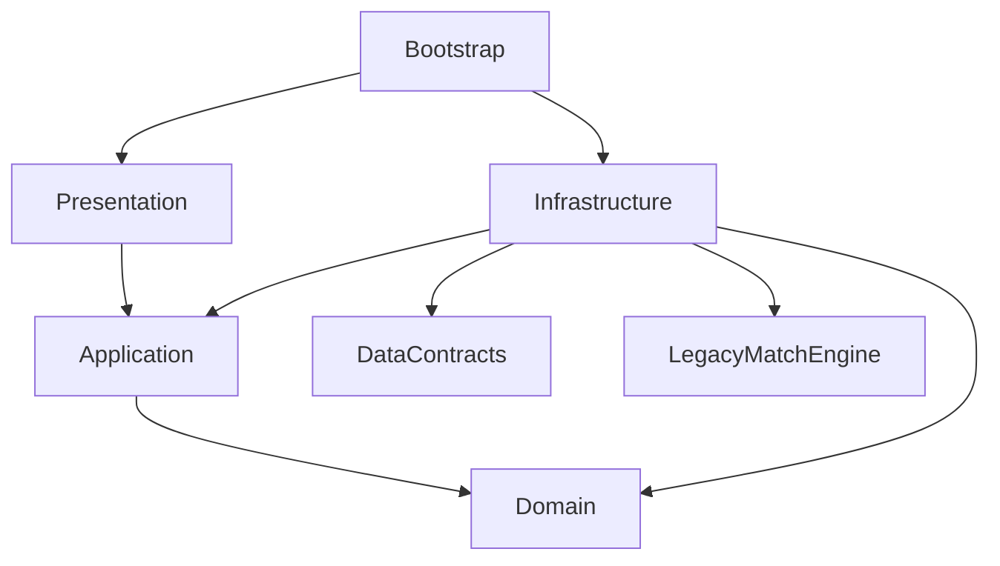

# Arquitetura do Futebol Brasileiro

Estado: decisões de arquitetura, revisão 0.1, 28/09/2026. Esta entrega é
documental. O campeonato, o importador, o editor externo e o processamento de
skins descritos aqui ainda serão implementados conforme [ROADMAP.md](ROADMAP.md).
O formato proposto está em [DATA-FORMAT.md](DATA-FORMAT.md).

## Objetivos

- Reutilizar a partida 3D existente em campeonatos e temporadas.
- Editar clubes, jogadores, competições e regulamentos em uma aplicação separada.
- Importar conteúdo compatível sem recompilar o jogo.
- Permitir à comunidade enviar skins com modelos e texturas próprios pelo editor
  da base, associá-las a jogadores e utilizá-las na partida WebGL.
- Manter regras esportivas, estado de jogo, apresentação e armazenamento com
  responsabilidades e dependências explícitas.

## Módulos e dependências

Os novos módulos do jogo ficarão sob `Assets/FootballSimulator/Code/FootballWorld`.
A organização interna pode ganhar subpastas por assunto, como `Competitions`,
`Clubs` e `Players`, conforme existam funcionalidades reais.

| Módulo | Responsabilidade | Dependências permitidas |
| --- | --- | --- |
| Domain | Identidades, definições esportivas, temporada, calendário, resultados e classificação | Biblioteca padrão C#; sem Unity, arquivos ou serializador |
| Application | Criar temporada, iniciar tentativa de jogo, concluir confronto, consultar estado | Domain e contratos de execução definidos pela própria Application |
| Infrastructure | Importação, mapeamento de dados, integração com motor 3D, mídia e futuro armazenamento | Contratos, Application, Domain e bibliotecas específicas da integração |
| Presentation | Prefabs UGUI/TMP, apresentação das consultas e envio de comandos | Application e abstrações de apresentação visual |
| Bootstrap | Construir e conectar serviços; manter a sessão durante transições | Implementações necessárias à composição |

Setas abaixo representam dependências de código:

`DataContracts` é a especificação portátil e seus DTOs de intercâmbio. Não depende
do core ou de Unity. O importador converte esses DTOs em definições do domínio.
Domain/Application não dependem da representação JSON nem de seus atributos de
serialização. O editor externo compartilha schemas, exemplos e regras de
compatibilidade; não precisa usar a mesma linguagem ou carregar o jogo.

Começar com assemblies separados para Domain e Application, sem referências ao
Unity. Adaptadores que usam o legado permanecem inicialmente na assembly padrão:
uma assembly criada por `.asmdef` não pode depender de classes em
`Assembly-CSharp`. Extrair o legado será uma mudança futura delimitada, se houver
necessidade. [Referência Unity](https://docs.unity3d.com/2022.3/Documentation/Manual/ScriptCompilationAssemblyDefinitionFiles.html).

Não introduzir um servidor para coordenar a competição local, repositórios
genéricos, um barramento global novo ou um framework de injeção apenas para
organizar pastas. Bootstrap conecta dependências explicitamente. Eventos globais
existentes ficam encapsulados pela ponte com o motor.

## Propriedade dos dados

| Informação | Proprietário | Tempo de vida |
| --- | --- | --- |
| Clubes, jogadores, vínculos iniciais, competições e regras | Base externa versionada | Revisão imutável importada |
| Confrontos, resultados, mudanças de elenco e progresso | Sessão da temporada | Durante a sessão; save próprio em etapa futura |
| Escalação e IDs locais de jogadores na partida | Adaptador e motor de partida | Uma execução de confronto |
| Retratos, escudos e skins | Catálogo visual e carregador de mídia | Recursos versionados, carregados conforme uso |

`ClubId`, `PlayerId`, `CompetitionId`, `SeasonId` e `FixtureId` são identidades
estáveis. Nomes e posições em listas são editáveis. A relação inicial clube/jogador
tem uma fonte de verdade na coleção de vínculos; não duplicar listas mutáveis em
ambas as entidades. Posição natural pertence ao jogador; posição na formação
pertence à escalação.

Uma temporada fixa a revisão da base e suas regras ao nascer. Atualizar o catálogo
oferece conteúdo para novas temporadas. Aplicar alterações a uma temporada
existente exigirá migração explícita. O futuro save guarda sua própria versão e
um snapshot dos dados necessários à retomada, incluindo referências exatas dos
recursos visuais; não depende de um catálogo remoto que pode mudar.

ScriptableObjects continuam adequados à autoria de materiais, catálogos de
recursos Unity, prefabs e parâmetros de apresentação. Não são o armazenamento
autoritativo do cadastro externo nem do progresso da temporada.

## Integração da competição com a partida

Contratos iniciais, ainda a implementar:

- `MatchRequest`: SeasonId, FixtureId, ExecutionId, clubes e escalações necessárias
  à execução, representados por dados independentes do motor.
- `MatchOptions`: lado controlado, dificuldade e opções de apresentação.
- `IMatchRunner`: inicia uma execução e devolve `Completed(result)`, `Abandoned`
  ou `Failed`. Unity3DMatchRunner implementa a execução atual; simulação rápida
  será outra implementação posteriormente.
- `MatchResult`: FixtureId, ExecutionId, IDs dos participantes e placar final,
  copiados antes de descarregar o motor. Não contém GameObjects ou TeamEntry.
- `CompleteFixture`: única operação de aplicação que aceita e registra resultado.

Só uma execução fica ativa por sessão. O confronto passa de pendente para em
execução e concluído. Abandono ou falha de carregamento devolve-o a pendente sem
placar; a nova tentativa recebe outro ExecutionId. Eventos de tentativas antigas
são ignorados. Repetir o mesmo resultado aceito é inofensivo; resultado conflitante
é rejeitado. A classificação é derivada dos resultados aceitos.

A sessão vive fora dos painéis. `MatchEngineLoader.CreateMatch` descarrega a UI
geral, e o adaptador precisa sobreviver a isso. Assinaturas de eventos e recursos
da partida são liberados em conclusão, falha e abandono.

Limitações observadas do legado que orientam a implementação:

- `TeamEntry` valida exatamente onze jogadores. O adaptador cria a representação
  temporária dos onze escalados, preservando o elenco completo no domínio.
- `MatchCreateRequest` atribui IDs locais 0 a 21. Manter um mapeamento para
  PlayerId; não exportar esses índices como identidade permanente.
- `FinalWhistleEvent` não contém placar, e o relógio é zerado antes do evento.
  Capturar um resultado definitivo na origem, antes da limpeza.
- `GoalCelebrationScene` atualiza o placar. Preservar esse comportamento durante
  a primeira integração; qualquer separação posterior exige testes de gols.

## Base externa e importação

Fluxo: leitura do pacote -> validação estrutural -> validação de referências e
capacidades -> mapeamento -> ativação de uma nova revisão do catálogo.

A validação estrutural usa o contrato descrito por JSON Schema. O importador
também verifica referências cruzadas, IDs repetidos, valores válidos e tipos de
regras suportados. O domínio mantém suas próprias invariantes. Um pacote inválido
não substitui a base ativa. Não executar scripts ou nomes de tipos recebidos em
JSON. Regulamentos parametrizam comportamentos implementados no jogo.

O editor oferece criar, editar, validar e exportar. O jogo continua utilizável sem
o editor em execução. A primeira integração usa um arquivo local; hospedagem de
catálogos públicos pode ser acrescentada como outra origem de conteúdo.

## Skins da comunidade

Importar uma skin personalizada é requisito da primeira versão utilizável do
editor externo. Selecionar presets é uma etapa intermediária. O caso de aceite é
um autor importar uma skin de jogador, por exemplo uma representação de Messi,
associá-la a um cadastro e vê-la animada no WebGL.

Uma skin pode fornecer cabeça, corpo, cabelo e texturas próprios dentro do perfil
de compatibilidade. `SkinId` é independente de PlayerId; sua revisão é imutável.
A vinculação fica no perfil visual do jogador e não determina atributos, colisão,
física, altura de gameplay, força do chute ou decisões de IA.

Separar dois artefatos:

1. **Fonte portátil:** modelo, texturas, metadados e mapeamento para o perfil de
   compatibilidade. Primeira rota proposta: FBX com rig compatível e PNG/JPG,
   seguindo um template de autoria fornecido pelo projeto. GLB poderá ganhar um
   conversor posterior; não existe importador genérico de GLB no projeto atual.
2. **Conteúdo preparado:** prefab visual, Avatar e materiais compatíveis, em
   Addressables/AssetBundles gerados para a versão do jogo e a plataforma alvo.
   O primeiro alvo é WebGL. O jogo carrega esse conteúdo preparado.

O editor permite selecionar o pacote fonte, acompanhar validação e compilação,
visualizar o resultado processado, corrigir problemas e associar a skin pronta.
A preparação é uma operação separada, iniciada pelo editor e executada por um
worker Unity; não é uma operação do core ou do navegador. Inicialmente o worker
será local, usando o Unity ativado e uma área isolada de processamento. Um serviço
hospedado é uma opção futura, com sua própria implantação e ativação. O fluxo
válido não deve exigir que o usuário abra Unity e configure cada skin manualmente.

O perfil versionado define rig/template, escala, pose de referência, associação
dos ossos, slots de material, encaixe do uniforme e limites de recursos. Antes de
liberar importações, medir e fixar limites de malhas/texturas/memória com 22
skins distintas no WebGL, junto ao estádio e demais recursos da partida.
Não prometer reparo automático de rig ou compatibilidade com
qualquer FBX. O editor mostra o motivo da rejeição e a orientação para o template.

O jogo mantém controle sobre Animator, eventos de chute/passe, componentes de
gameplay e shaders permitidos. Preservar as referências e os offsets usados para
posicionar a bola, além da fase dos eventos de passe/chute: um Avatar válido não
garante sozinho que o contato com a bola continue correto. Fontes da comunidade não introduzem scripts,
plugins, controladores executáveis ou alterações de regras.

Hoje `PlayerGraphic.SetPlayer` substitui o material principal pelo uniforme.
O adaptador visual deverá separar slots de pele/rosto/cabelo e uniforme, preservar
texturas personalizadas e testar troca de clube e uniforme de goleiro. Uma skin
deve continuar reconhecível usando os uniformes da competição.

Skins ausentes ou incompatíveis produzem diagnóstico visível e usam o modelo
padrão aprovado quando houver fallback autorizado pelo contrato. O vínculo
original é preservado, para permitir recuperar o recurso depois. Exportar uma
base sem suas dependências gráficas exige uma indicação explícita no manifesto.

Distribuir conteúdo compatível por Addressables permite atualizações de recursos
sem republicar o player, depois que o carregador e o contrato estiverem presentes.
Mudanças de código, shaders não suportados ou contratos podem exigir um novo
player. [Referência Addressables 1.22](https://docs.unity3d.com/Packages/com.unity.addressables@1.22/manual/remote-content-intro.html).

## Verificação

Cada etapa segue o [AGENTS.md](AGENTS.md): preservar mudanças alheias, gerar build
WebGL novo, servir com Compose e validar o comportamento afetado. Testes de regras
puros cobrem calendário, pontuação e duplicidade; testes de integração cobrem
transições do motor e importação; testes visuais cobrem material e animação de
skins. Aprovar compilação não comprova que uma skin funciona durante uma partida.
